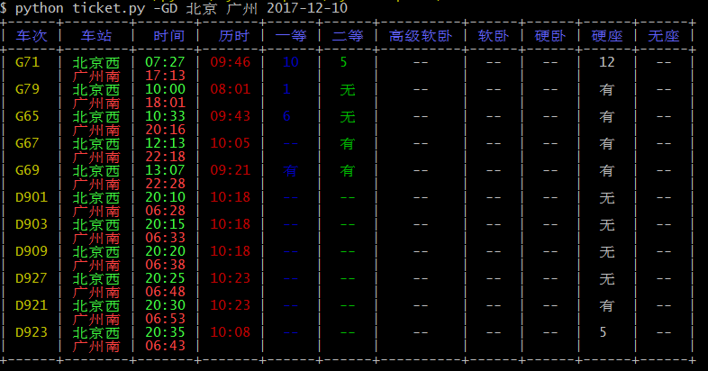
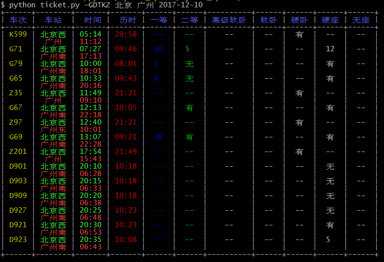

#环境
Linux

Python 2.7.10

#安装第三方库
```bash
pip install requests
pip install PrettyTable
pip install docopt
pip install colorama
```
#测试
 
**只查询高铁和动车:**
```bash
python ticket.py -GD 北京 广州 2017-12-10
```


**查询高铁、动车、特快、快速、直达:**
``` bash
python ticket.py -GDTKZ 北京 广州 2017-12-10
```

